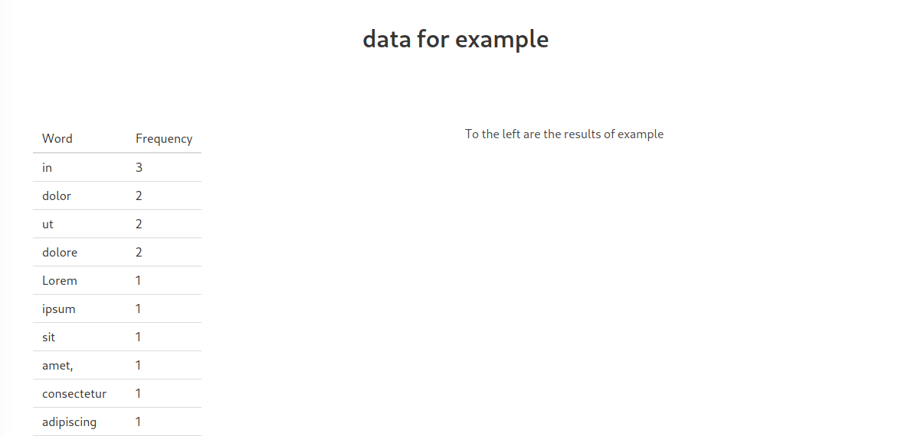

# word-counter

word-counter is a Python program for counting words. 🔢

## Installation

Install Python if you dont already have it

[Python](https://www.python.org/downloads/)

Clone the git repo

```bash
git clone https://github.com/JaffarA/word-count.git
```

Install requirements

```bash
pip install -r requirements.txt
```

## Usage

You can use the program in two ways

Supplying args via commandline

```bash
python word-count.py <file>
```

e.g.

```bash
python word-count.py example.txt
```

OR

Supplying args via in program input

```bash
python word-count.py
```

...outputs a file in the ```out/``` folder in the projects directory with the same name as the input file (with '-out' appended).



## Features

Blacklist

A simple blacklist.txt file is available in the root directory, any text in this file will be ignored when counting words.

## Contributing
Pull requests are welcome. For major changes, please open an issue first to discuss what you would like to change.

## FAQ

If any questions are ever asked, they will be answered here. 🙋

## License
[GPL-3](https://choosealicense.com/licenses/gpl-3.0/)