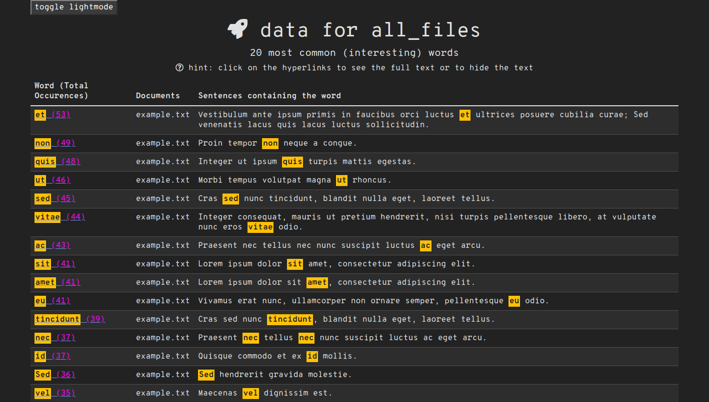

# word-counter

word-counter is a Python program for counting words using NLTK. 🔢

## Requirements

Python >=3.7.1,<3.11

Recommended version: 3.9.7

## Installation

Install Python if you dont already have it

[Python](https://www.python.org/downloads/)

Install Poetry if you dont already have it

[Poetry](https://python-poetry.org/docs/#installation)

Clone the git repo

```bash
git clone https://github.com/JaffarA/word-count.git
```

Install requirements

```bash
poetry install
```

## Usage

Files are read from the src/ directory, all .txt files found in that directory will be parsed. Run the main program.

```bash
# poetry run python word-count.py
poetry shell
python word-count.py
```

...outputs files in the ```out/``` folder in the projects directory with the same name as the input file (with '-out' appended).

### note: some words appear to have only one sentence, this is because by default only the first sentence is displayed, click on the word hyperlink (in the word (total occurences) column) to expand/collapse.

Light


Dark


## Features

Blacklist

A simple blacklist.txt file is available in the root directory, any text in this file will be ignored when counting words.

## Contributing
Pull requests are welcome. For major changes, please open an issue first to discuss what you would like to change.

## FAQ

If any questions are ever asked, they will be answered here. 🙋

## License
[GPL-3](https://choosealicense.com/licenses/gpl-3.0/)